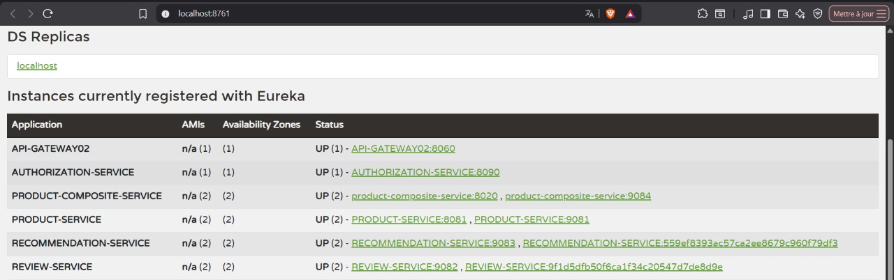
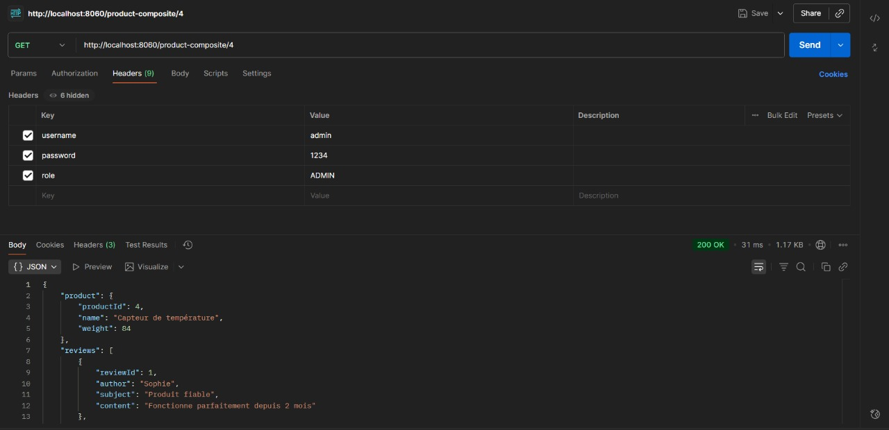
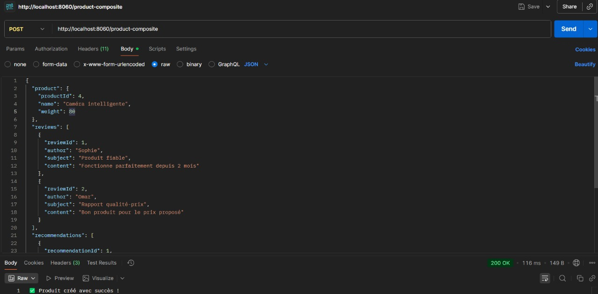
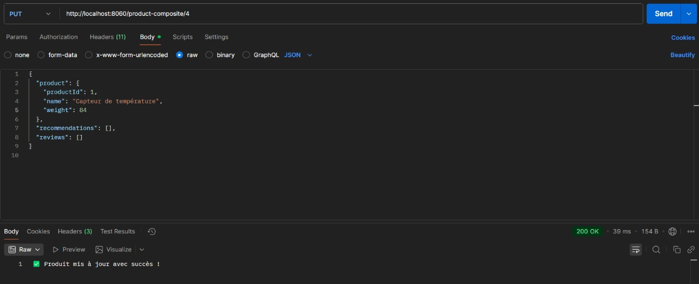
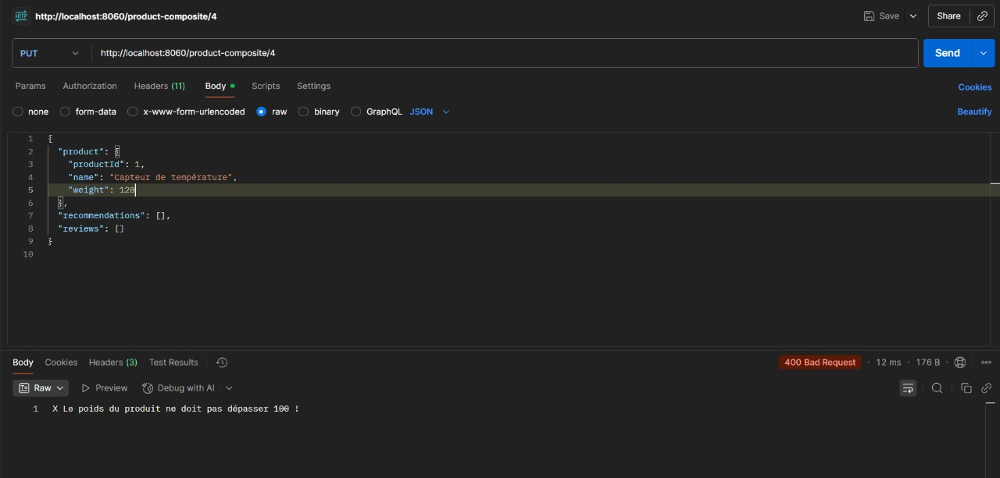
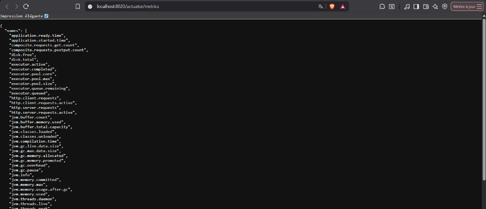
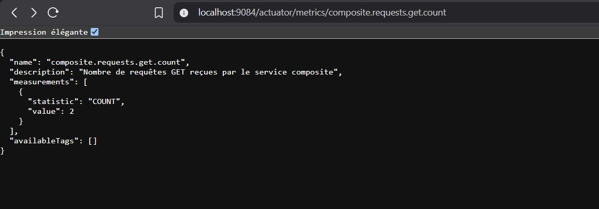
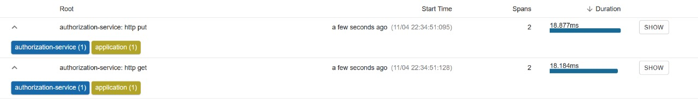
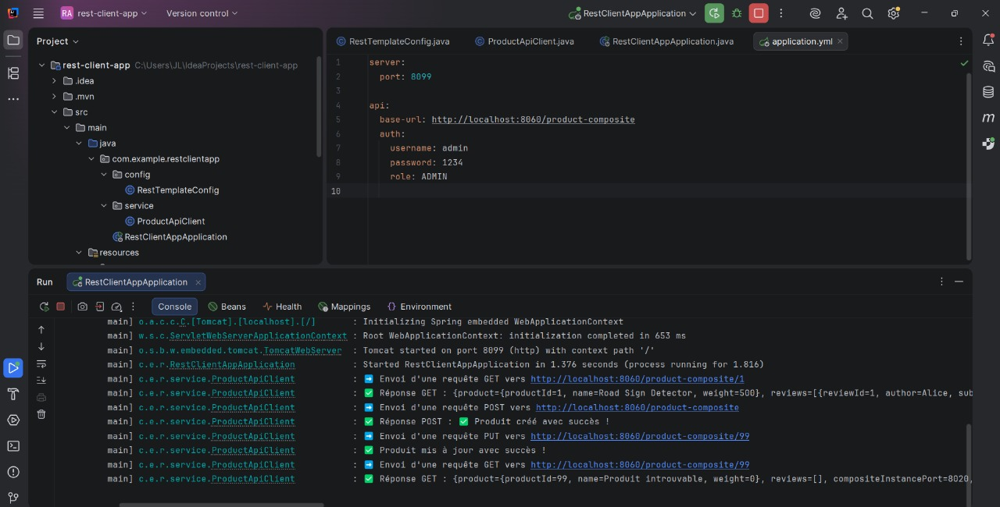

# 🧩 Spring Cloud Microservices – TP Complet  

## 🏗️ Architecture Globale  

Ce projet met en œuvre une architecture microservices complète avec **Spring Cloud**, incluant :  

- **Eureka Server** – Découverte de services  
- **API Gateway** – Routage centralisé  
- **Config Server** – Centralisation des configurations  
- **Product-Service**, **Review-Service**, **Recommendation-Service** – Services métiers  
- **Product-Composite-Service** – Service d’agrégation (orchestrateur)  
- **Authorization-Service** – Authentification simple  
- **Rest-Client-App** – Application cliente REST pour tester les appels  

### 📘 Schéma global de l’architecture  



---

## ⚙️ Découverte des services avec Eureka  

Tous les microservices s’enregistrent automatiquement auprès du **Discovery Server** :  



> Chaque service affiche son nom, son port et son statut `UP`.  

---

## 🚀 Tests via Postman  

### ➕ Création d’un produit (POST)  
  

**Résultat attendu :**
```json
✅ Produit créé avec succès !
```

---

### ✏️ Mise à jour d’un produit (PUT)  
  

**Résultat :**
```json
✅ Produit mis à jour avec succès !
```

⚠️ Si le poids dépasse 100, une erreur de validation est renvoyée :  


---

### 🔍 Lecture d’un produit (GET)  
  

Le **ProductCompositeService** agrège les données provenant de :  
- Product-Service  
- Review-Service  
- Recommendation-Service  

---

## 📊 Monitoring et Metrics  

Le service composite expose des métriques via **Spring Boot Actuator**.  

### 🔹 Toutes les métriques disponibles  
  

### 🔹 Nombre de requêtes GET  
  

### 🔹 Nombre de requêtes POST/PUT  
  

---

## 🔎 Traces distribuées avec Zipkin  

Exemple de traçage pour le service `authorization-service` :  
  

> Chaque requête HTTP est suivie avec sa durée d’exécution et ses spans.  

---

## 🧠 Exemples de logs d’exécution  

### 📦 Agrégation complète d’un produit  

```
🎯 Requête reçue sur ProductCompositeController (port=9084) pour productId=4
➡ Début de l’agrégation pour productId=4
➡ Appel Product-Service via LoadBalancer pour productId=4
✅ Product récupéré : Capteur de température (poids = 84)
➡ Appel Review-Service via LoadBalancer pour productId=4
📝 Nombre d’avis récupérés : 2
➡ Appel Recommendation-Service via LoadBalancer pour productId=4
💡 Nombre de recommandations récupérées : 0
✅ Agrégat final généré avec succès pour productId=4
✅ Réponse envoyée avec les infos des instances pour productId=4
```

---

### ⚠️ Cas d’erreur sur mise à jour  

```
✏ Requête PUT reçue pour mise à jour du produit id=4 avec poids=-10
✏ Mise à jour du produit id=4 (nouveau poids=-10)
✏ [Integration] Mise à jour du produit id=4 (poids=-10)
❌ Erreur lors de la mise à jour du produit composite : [400] during [PUT] to [http://PRODUCT-SERVICE/product/4]
✏ Requête PUT reçue pour mise à jour du produit id=4 avec poids=120
❌ Poids invalide (120) - doit être <= 100
```

---

### 🧾 Logs du client REST  

```
➡ Envoi d'une requête GET vers http://localhost:8060/product-composite/1
✅ Réponse GET : {product={productId=1, name=Road Sign Detector, weight=500}, ...}
➡ Envoi d'une requête POST vers http://localhost:8060/product-composite
✅ Réponse POST : ✅ Produit créé avec succès !
➡ Envoi d'une requête PUT vers http://localhost:8060/product-composite/99
✅ Produit mis à jour avec succès !
```

---

## 🧰 Technologies utilisées  

| Composant | Description |
|------------|-------------|
| **Spring Boot** | Framework principal |
| **Spring Cloud** | Eureka, Config Server, Gateway, Feign |
| **Lombok** | Réduction du code boilerplate |
| **Actuator & Micrometer** | Monitoring |
| **Zipkin** | Traçabilité distribuée |
| **Postman** | Tests API |
| **H2 Database** | Base de données en mémoire |
| **Maven** | Gestionnaire de dépendances |
| **IntelliJ IDEA** | IDE de développement |

---

## ✅ Conclusion  

Ce TP illustre :  
- L’orchestration d’une architecture **microservices complète**  
- La **résilience** via Eureka & LoadBalancer  
- Le **monitoring** avec Actuator et Micrometer  
- Le **traçage distribué** avec Zipkin  
- La **validation** des requêtes et la gestion des erreurs dans le Composite Service  
- L’intégration d’un **client REST automatisé**  

---

✳️ *Auteur : Abdeljalil (JL)*  
📅 *Dernière mise à jour : 04/11/2025*
